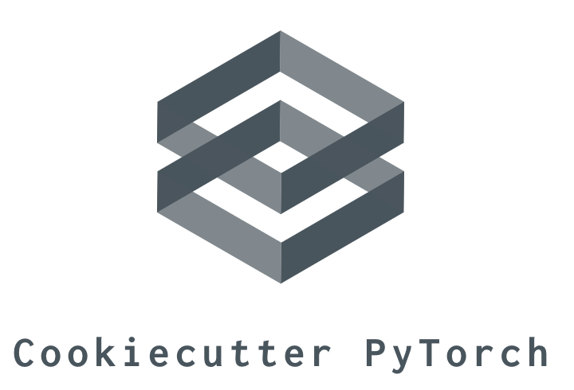

# PyTorch Cookiecutter

Developing a deep learning model requires extensive experimentation and evaluation. Throughout the life cyle of a project, it's very easy to lose track of the various models, data sets, and hyper-parameters. Having an organized repository makes this process much easier. 

I found the text recognizer project demoed at the [Full Stack Deep Learning bootcamp](https://github.com/full-stack-deep-learning/fsdl-text-recognizer-project) inspiring and excellent. I decided to try to generalize their repo as a template for future projects. [Cookiecutter](https://github.com/cookiecutter/cookiecutter) is a tool for creating project templates and I decided to use it to create template in the spirit of the FSDL text recognizer, but use PyTorch instead of Keras as the deep learning framework. 

Thsi template is certainly not unique as many other similar projects exist. I suppose what makes this unique is it is specifically inspired by the work done at the bootcamp. This is still a work in progress (isn't everything?) and is meant mostly for my own work, but maybe others will also find it useful. 

## Starting a new project

If [cookiecutter](https://github.com/cookiecutter/cookiecutter) is not installed, first `pip install cookiecutter` 

After cookiecutter is installed, clone the PyTorch Cookiecutter template:
```cookiecutter https://github.com/myazdani/pytorch-cookiecutter```

